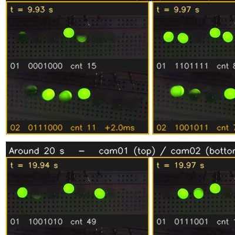

<table style="width:100%;border:0px;border-spacing:0px;border-collapse:separate;margin-right:auto;margin-left:auto;">
  <tr>
    <td style="padding:1% 2.5%;width:100%;vertical-align:middle">

<h2>About Me</h2>

I am Yubo Huang. I was born in Xinzhou, Shanxi, China, in 1998. I received my B.S. (2020) and M.Eng. (2023) degrees from <a href="https://www.bupt.edu.cn/" target="_blank" rel="noopener">Beijing University of Posts and Telecommunications</a>.

    </td>
  </tr>
</table>

<table style="width:100%;border:0px;border-spacing:0px;border-collapse:separate;margin-right:auto;margin-left:auto;">
  <tr>
    <td colspan="2" style="padding:1% 2.5%;vertical-align:middle">
      <h2>Projects</h2>
    </td>
  </tr>
  <tr class="proj-row">
    <td class="proj-img" style="padding:1% 2.5%;width:25%;vertical-align:middle;min-width:120px">
      
    </td>
    <td class="proj-text" style="padding:1% 2.5%;width:75%;vertical-align:middle">
      <h3><a href="/motion-capture.html">Motion Capture and 3D Reconstruction</a></h3>
      

      A fully mobile, markerless motion-capture rig of eleven synchronized smartphones for high-fidelity 3D reconstruction in the wild, with cattle reconstruction, human pose, and IMU motion-capture demos.
      

    </td>
  </tr>
  <tr class="proj-row">
    <td class="proj-img" style="padding:1% 2.5%;width:25%;vertical-align:middle;min-width:120px">
      
    </td>
    <td class="proj-text" style="padding:1% 2.5%;width:75%;vertical-align:middle">
      <h3><a href="https://yuboshell.github.io/led-sync-panel/report.html" target="_blank" rel="noopener">LED Timecode Panel</a></h3>
      

      A DIY LED timecode panel that stamps a per-frame binary code into every camera's view, for measuring multi-camera synchronization to sub-millisecond precision (the capture rig behind the Pixel-7 sync-evaluation project).
      

    </td>
  </tr>
</table>

<table style="width:100%;border:0px;border-spacing:0px;border-collapse:separate;margin-right:auto;margin-left:auto;">
  <tr>
    <td colspan="2" style="padding:1% 2.5%;vertical-align:middle">
      <h2>Publications</h2>
    </td>
  </tr>

  
  <tr class="proj-row">
    <td class="proj-img" style="padding:1% 2.5%;width:25%;vertical-align:middle;min-width:120px">
      
      
      
    </td>
    <td class="proj-text" style="padding:1% 2.5%;width:75%;vertical-align:middle">
      <h3><a href="{{ link.pdf }}" target="_blank" rel="noopener">{{ link.title }}</a>{{ link.title }}</h3>
      

        {{ link.authors }} 
        <em>{{ link.conference }}</em>
      

      

        <a href="{{ link.pdf }}" target="_blank" rel="noopener">PDF</a>
         / <a href="{{ link.code }}" target="_blank" rel="noopener">Code</a>
         / <a href="{{ link.page }}" target="_blank" rel="noopener">Project Page</a>
         / <a href="{{ link.bibtex }}" target="_blank" rel="noopener">BibTeX</a>
         <strong><i>{{ link.notes }}</i></strong>
      

    </td>
  </tr>
  

</table>
